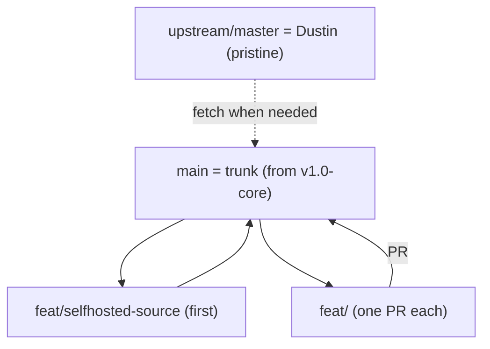

# Migration Roadmap

Goal: migrate a full Sentry organization from **self-hosted v25 -> Sentry SaaS**. The core scope
(Projects, Teams & Membership, Alert Rules) is complete and frozen at tag `v1.0-core`. Remaining data
types are delivered one at a time as small feature branches merged into `main` via PR.

## Branch model

- `main` -- integration trunk, started from the `v1.0-core` checkpoint. Default branch. Everything is
  merged here via PR.
- `master` -- pristine mirror of upstream `dgbailey/migration`; used only to pull Dustin's updates
  (`git fetch upstream`). Never developed on.
- `phase-2-core` + tag `v1.0-core` -- the frozen checkpoint. Never modified.
- `feat/<data-type>` -- one branch per data type below, one PR into `main`.



## Repository layout

The toolkit is organized into per-tool subfolders, each with its own run-guide `README.md`:

```
migration/
  README.md ROADMAP.md DECISIONS.md CHANGELOG.md SOURCING.md
  common/            selfhosted_source.py            (shared read-only self-hosted API client)
  preflight/         duplicates_report.py            (step 0: cross-org collision report)
  core/              create_sentry_projects.py create_sentry_teams.py
                     add_sentry_members.py assign_team_members.py migrate_alert_rules.py
  org-settings/      migrate_org_settings.py
  project-settings/  migrate_project_settings.py
  data-scrubbers/    migrate_data_scrubbers.py
```

The three settings tools import `common/selfhosted_source.py` via a small `sys.path` shim so each stays
runnable directly from the repo root (`python3 org-settings/migrate_org_settings.py ...`).

## Two data sources

The relocation export (`export organizations`) only carries a subset of models, so there are two sources:

- **Export-driven** -- parse `export.json` (what phase-2 uses). Covers what the export contains.
- **Live self-hosted reader** -- `selfhosted_source.py`, a read-only client for the running
  self-hosted API (`http://127.0.0.1:9000/api/0`). Covers everything the export omits.

Confirmed against `migration-testing/export.json`:
- In the export: `sentry.organization` (name, default_role, flags), `sentry.project` +
  `sentry.projectoption` (non-default only) + `sentry.projectkey`, `sentry.team`,
  `sentry.organizationmember` (real `role`), `sentry.rule`.
- NOT in the export: `sentry.organizationoption` (org data-scrubbing defaults, retention),
  `sentry.useroption`, `sentry.dashboard`, `sentry.monitor`, `sentry.repository`, `sentry.savedsearch`.

New prereq for the live reader: a self-hosted auth token / internal integration with read scopes
(`org:read`, `project:read`, `team:read`, `member:read`, `alerts:read`).

## Status

Core (done, tagged `v1.0-core`):

- Projects
- Teams & membership
- Alert rules (metric); **issue alerts added post-`v1.0-core` in `feat/issue-alerts`** (DONE — both alert
  types now migrated; issue-alert notification actions defaulted to email the owner team, see DECISIONS.md D9)

Pre-flight (run first, before any migration):

- `feat/duplicates-report` -- **cross-org duplicates / collision report** (DONE). `duplicates_report.py`
  reads one JSON export per self-hosted org and reports project-name collisions (HARD), team-slug
  collisions (HARD), team-name collisions with a **membership diff**, and similar org names. Export-based
  / offline for now (see DECISIONS.md D7). This is the consolidation (export-vs-export) half of the
  collision-preflight idea below.
  - Expected real-world scale for the pilot merge: **Dor-Org1 ~20 projects (high volume, top priority)**,
    **Dor-Org2 ~1000 projects (lower volume, likely unused duplicates)**, Dor-Org3, ... all merging into
    **one** SaaS org. The report is O(n) (dict/set lookups) so this size is trivial to compute; at ~1000+
    projects the console listing gets long, so `duplicate_report.json` is the durable/source-of-truth
    output. A larger-scale test (seed Org2 to hundreds/thousands of projects) is a good follow-up before
    the real run.

Foundation (do first):

- `feat/selfhosted-source` -- shared live self-hosted reader that later features depend on.
  Introduced as `selfhosted_source.py` in `feat/org-settings` and extended per feature.

Milestone: settings

- `feat/org-settings` -- Organization settings (DONE, merged: governance + privacy whitelist)
- `feat/project-settings` -- Projects and their settings (DONE, merged: core general-settings whitelist,
  greenfield / match-by-name)
- `feat/data-scrubbers` -- Enabled data scrubbers (DONE, merged: standard scrubbers, org + project;
  advanced custom-PII excluded per DECISIONS.md D5)
- `feat/member-roles` -- User accounts / member options (roles)
- Teams and their settings -- verify-only (teams carry only name/slug/status; no dedicated branch
  unless org-level team roles warrant one)

Milestone: content (all live-API sourced; depend on the reader)

- `feat/monitors` -- Crons
- `feat/dashboards` -- Dashboards (DONE: custom dashboards + widgets, live-API sourced, project remap by
  name, `discover`→`error-events`/`spans` dataset translation, verified live)
- `feat/repos` -- Repositories (integration-gated)
- `feat/saved-searches` -- Saved searches (recent/per-user searches are out of scope)

Delivery model: distinct, separately-run tools (no single auto-orchestrator)

Per supervisor direction (see DECISIONS.md D8), the toolkit ships as **distinct tools the operator runs
one at a time, in a documented order** -- NOT a single `migrate.py` wizard that chains everything. The
reason is overwrite safety: a one-button run makes it too easy to fire a step that mutates the
destination before the operator has reviewed the prior step's output. Each tool:

- does one data type, is independently runnable, and is `--dry-run`-first;
- writes its own results file the operator reviews before running the next tool;
- requires the operator to explicitly pass tokens at run time (no credentials committed or shipped).

Instead of a wizard, delivery = a **README run-order / runbook** that lists the tools in sequence
(pre-flight `duplicates_report.py` -> projects -> teams -> membership -> settings -> scrubbers ->
alerts -> ...), each an explicit, separate command. A thin optional convenience runner may be
reconsidered later, but only as opt-in and never as the default path.

Hardening (future; needed before brownfield customers):

- `feat/collision-preflight` -- today every feature assumes a **greenfield** destination (a fresh SaaS
  org we control). Real customers may migrate into an **existing, in-use** org, where names/slugs can
  collide with objects the customer already relies on. This milestone adds:
  - a `--dry-run` **pre-flight report** per data type ("these already exist in the destination"),
    generalizing `duplicates_report.py` from export-vs-export (already delivered) to
    source-vs-live-destination;
  - a configurable **per-type policy** (`skip` / `rename` / `merge` / `overwrite` / `fail`);
  - **provenance tracking** so re-runs only touch migration-created objects (safe idempotency);
  - a safe default of report-only / skip for org-level and security settings.
  Open question for the customer: are migrations always into a fresh org, or sometimes brownfield? That
  answer decides how much of this we build.

## Feature specs

Every feature reuses the phase-2 mapping files as foreign-key currency
(`project_team_sync_results.json` -> team ids + project slugs, `member_id_mappings.json` /
`user_mappings_for_teams.json` -> member ids) and follows the pattern: `--dry-run`, writes a
`*_results.json`, one new script file, core scripts untouched. Endpoint paths are best-known and to be
confirmed during each build.

### feat/selfhosted-source (foundation)
- File: `selfhosted_source.py`. Read-only client for `http://127.0.0.1:9000/api/0` (auth, pagination,
  errors). Mirror of the SaaS writer classes but GET-only.
- Merges first; `feat/data-scrubbers` and all content features import it.

### feat/org-settings
- Source: export `sentry.organization` (default_role, flags) + live GET `/organizations/{org}/`.
- Target: PUT `/organizations/{org}/` (whitelist: `defaultRole`, `openMembership`,
  `allowJoinRequests`, `enhancedPrivacy`; skip slug/features/plan).
- Deps: destination org exists. Script: `migrate_org_settings.py`.

### feat/project-settings (DONE)
- Source: live GET `/organizations/{org}/projects/` then per-project GET `/projects/{org}/{proj}/`.
- Matching (greenfield): pair source -> destination by project **name** (case-insensitive), then PUT
  using the destination's own slug (phase-2 reassigned slugs but preserved names). Source projects with
  no name match are skipped and reported; brownfield collision handling is deferred (see below).
- Target: PUT `/projects/{org}/{proj}/`. Whitelist (core general settings): `resolveAge`,
  `allowedDomains`, `scrapeJavaScript`, `verifySSL`, `subjectPrefix`, `subjectTemplate`,
  `defaultEnvironment`, `highlightTags`, `highlightContext`. Data-scrubbing fields are deferred to
  `feat/data-scrubbers`; identity/advanced/risky fields are skipped. Both groups are recorded per
  project in the results file.
- Deps: phase-2 projects + the live reader (`selfhosted_source.py`). Script:
  `migrate_project_settings.py`. Needs a SaaS token with `project:write`.

### feat/data-scrubbers (DONE)
- Source: live GET `/organizations/{org}/` (org level) and per-project GET `/projects/{org}/{proj}/`.
- Whitelist (standard, both levels): `dataScrubber`, `dataScrubberDefaults`, `sensitiveFields`,
  `safeFields`, `scrubIPAddresses`, `storeCrashReports`. Advanced `relayPiiConfig` / `trustedRelays`
  excluded (recorded, not dropped) -- see DECISIONS.md D5.
- Matching: projects paired by name (reuses feat/project-settings). Target: PUT org + PUT each project.
  `--org-only` / `--projects-only` scope flags. Deps: org + projects + the live reader. Script:
  `migrate_data_scrubbers.py`. Needs a SaaS `org:write` + `project:write` token.

### feat/member-roles
- Source: export `sentry.organizationmember.role`.
- Target: preserve real role via PUT `/organizations/{org}/members/{member_id}/` `{orgRole}` after the
  invite (needs a `member:admin` token). User notif options (`sentry.useroption`) are not in the export
  and not admin-settable for other users -> documented as self-serve / out of scope.
- Deps: phase-2 members + member id map. Script: `migrate_member_roles.py`.

### feat/monitors (needs reader)
- Source: live GET `/organizations/{org}/monitors/`.
- Target: POST `/organizations/{org}/monitors/` (schedule, checkin_margin, max_runtime, timezone,
  project). Deps: projects. Script: `migrate_monitors.py`.

### feat/dashboards (needs reader) — DONE
- Source: live GET `/organizations/{org}/dashboards/` + per-dashboard widgets (custom only; prebuilt skipped).
- Target: POST `/organizations/{org}/dashboards/`; remap dashboard `projects` + widget `project:`/`project.id:`
  conditions via a name-matched source→dest project map.
- Dataset translation: legacy `discover` widgets → `error-events`, or `spans` (with `is_transaction:true` /
  `span.duration` rewrite) for transaction-oriented widgets, driven by real SaaS 400s.
- Idempotent (skip-by-title), `--dry-run`, `--only`, GET-back verification, `dashboard_migration_results.json`.
- Script: `dashboards/migrate_dashboards.py`. Seeder: `seed-data/seed_dashboards.py`. Tests:
  `tests/test_dashboards.py`. Verified live into `dorian-v25-migration`.

### feat/repos (needs reader)
- Source: live GET `/organizations/{org}/repos/`.
- Target: POST `/organizations/{org}/repos/` -- gated on the destination org having the source-code
  integration (GitHub/GitLab) installed and authorized. Best-effort/partial; integration prereq
  documented. Script: `migrate_repos.py`.

### feat/saved-searches (needs reader)
- Source: live GET `/organizations/{org}/searches/`.
- Target: POST `/organizations/{org}/searches/`. Recent/per-user searches are out of scope.
- Script: `migrate_saved_searches.py`.

## Acceptance criteria (per feature/PR)

- Dry-run prints the exact intended API call against the seeded/live source.
- After a live run, the SaaS test org (`dorian-v25-migration`) matches source for the whitelisted fields.
- Anything not carried is listed explicitly in the script output and here (no silent drops).
- Merge order respects dependencies: `feat/selfhosted-source` first, then features that import it.

## Working model (do not disrupt the checkpoint)

- The `v1.0-core` tag and the core scripts are frozen; never modified.
- One data type = one `feat/*` branch = one new script file = one PR into `main`. Near-zero conflicts
  because features only add files.
- Reuse the running slim-core self-hosted stack and the `dorian-v25-migration` SaaS test org as-is.
- Pull Dustin's upstream updates via `git fetch upstream` into `master`, then merge into `main` if wanted.
